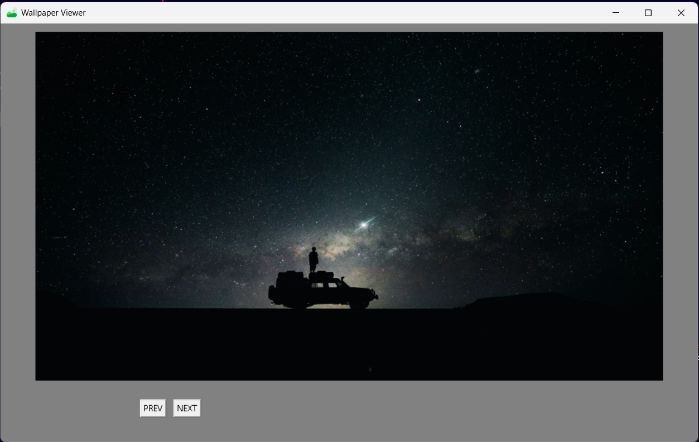

# 🖼️ Wallpaper Viewer

A simple desktop wallpaper viewer built with Python and Tkinter.
Loads every image from a folder and lets you browse through them
one by one using Prev and Next buttons.

---

## 📸 Preview

> Add a screenshot of your app here after running it.
> 

---

## 🚀 Features

- Dynamically loads all images from a folder — no hardcoding
- Prev and Next buttons to browse images
- Buttons automatically disable at the first and last image
- Supports multiple image formats
- Fixed window size for a clean consistent layout
- Custom favicon/icon support

---

## 🛠️ Built With

- [Python 3](https://www.python.org/)
- [Tkinter](https://docs.python.org/3/library/tkinter.html) — GUI
- [Pillow](https://pillow.readthedocs.io/) — image loading and resizing
- [pathlib](https://docs.python.org/3/library/pathlib.html) — file path handling

---

## 📁 Project Structure

```
Wallpaper Viewer/
│
├── wallpaper_viewer.py   # main script
├── favicon.ico           # window icon
├── README.md             ← You are here
├── notes.md              # Raw thoughts, mistakes, what confused me
│
└── Wallpapers/           # put your images here
    ├── image1.jpg
    ├── image2.png
    └── ...
```

---

## ⚙️ Setup & Installation

**1. Clone the repository**
```bash
git clone https://github.com/YOUR_USERNAME/wallpaper-viewer.git
cd wallpaper-viewer
```

**2. Install dependencies**
```bash
pip install pillow
```
> Tkinter comes built-in with Python. No extra install needed.

**3. Add your images**

Drop any images into the `Wallpapers` folder. Supported formats:
`.jpg` `.jpeg` `.png` `.bmp` `.gif` `.webp`

**4. Run the app**
```bash
python wallpaper_viewer.py
```

---

## 🧠 How It Works

- On startup, all images inside the `Wallpapers` folder are loaded,
  resized to `900x500`, and stored in a list
- The first image is displayed immediately
- Clicking **Next** increments the index — modulo wrapping ensures it
  loops back to the first image after the last one
- Clicking **Prev** decrements the index the same way
- Prev is disabled on the first image, Next is disabled on the last image

---

## 📝 What I Learned

- Dynamically loading files from a folder using `pathlib`
- Converting PIL images to a Tkinter-compatible format with `ImageTk.PhotoImage()`
- Using modulo `%` to wrap around a list infinitely
- Managing state between functions using a mutable dictionary
- Building and laying out a GUI with Tkinter widgets

---

## 🐛 Known Issues

- Images are resized to a fixed size — very small or very wide images
  may appear stretched
- Folder must be named exactly `Wallpapers` and placed in the same
  directory as the script

---

## 📄 License

This project is open source and free to use.